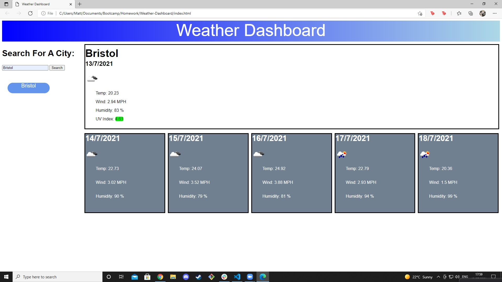

# Weather-Dashboard

# Link To Project
https://esper06.github.io/Weather-Dashboard/

# Screenshot Of Project

# Description

My motivation for this was to create a weather dashboard in order to test my skills in javascript and to expand my portfolio.

# Installation

1: Download repo from github. 2: Save where desired. 3: Open file with a text editor of your choice.

For accessing the website rather than the code follow these instructions:

1: Copy link provided in this README

# Usage 

1: Type a city name in the search bar. 
2: Click the search button. 
3: Your searched city will be saved in local storage. 
4: In the large box it will show you the weather conditions for today, as well as a UV index that is colour coded from green to red in order of least severe to most severe. 
5: Below the large box is 5 small boxes that show you the future weather conditions for that city

# License 

MIT License

Copyright (c) [2021] [Matthew Walford]

Permission is hereby granted, free of charge, to any person obtaining a copy of this software and associated documentation files (the "Software"), to deal in the Software without restriction, including without limitation the rights to use, copy, modify, merge, publish, distribute, sublicense, and/or sell copies of the Software, and to permit persons to whom the Software is furnished to do so, subject to the following conditions:

The above copyright notice and this permission notice shall be included in all copies or substantial portions of the Software.

THE SOFTWARE IS PROVIDED "AS IS", WITHOUT WARRANTY OF ANY KIND, EXPRESS OR IMPLIED, INCLUDING BUT NOT LIMITED TO THE WARRANTIES OF MERCHANTABILITY, FITNESS FOR A PARTICULAR PURPOSE AND NONINFRINGEMENT. IN NO EVENT SHALL THE AUTHORS OR COPYRIGHT HOLDERS BE LIABLE FOR ANY CLAIM, DAMAGES OR OTHER LIABILITY, WHETHER IN AN ACTION OF CONTRACT, TORT OR OTHERWISE, ARISING FROM, OUT OF OR IN CONNECTION WITH THE SOFTWARE OR THE USE OR OTHER DEALINGS IN THE SOFTWARE.